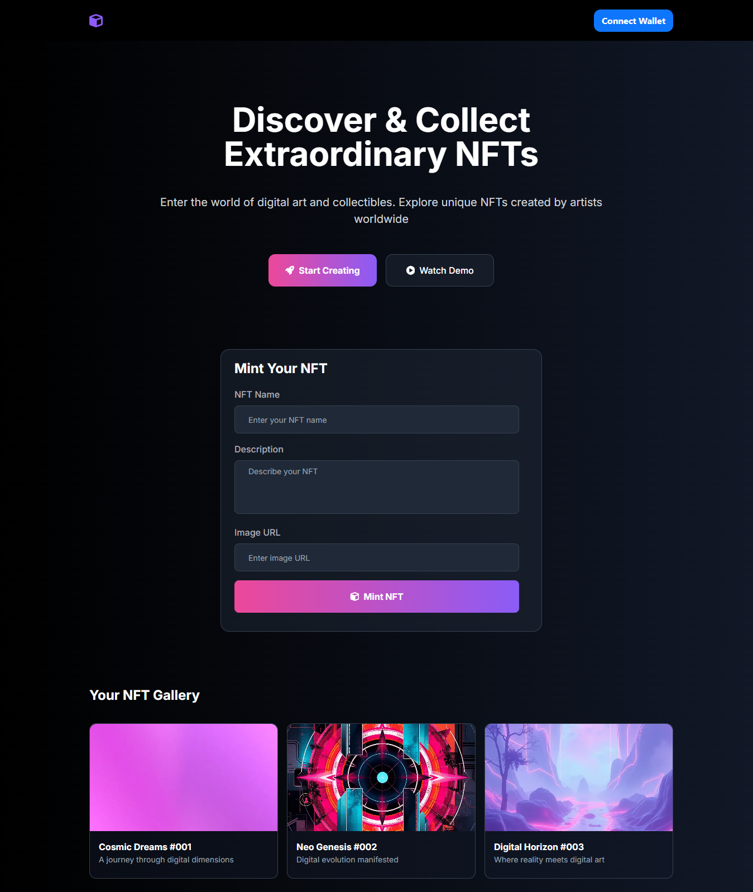

# nftMint



## Project Overview

The frontend of the NFT Minting Application was built using Next.js, following the provided Figma design. It includesthe following key features:

-UI Design Implementation:
-Users will connect their Ethereum wallet (e.g., MetaMask) to mint NFTs.
-Once connected, users can mint NFTs by filling out a form (NFT name, description, logo, etc.).
The application will interact with the Ethereum smart contract to process the minting transaction.
The frontend will call the Node.js backend to retrieve metadata for minted NFTs and display them to the user.
This frontend was deployed on vercel


### Tech Stack

Frontend:

- Next.js (React framework)
- Tailwind CSS (for styling)
- React Toastify (for notifications)


Other Libraries:

- Axios for API calls
- React Hook Form for form handling

## Getting Started

To get started with this project, follow the steps below:

### Installation

1. Clone the repository.

   ```sh
   https://github.com/ChinenyeNmoh/NFTMinting/tree/main/frontend

   ```

2. Install the required packages.

   ```sh
   npm install package.json
   ```


### Start the application for development.

```sh
npm run dev 

```

## Deployment

Frontend: The frontend is built with Next.js and deployed on Vercel for fast and reliable hosting, leveraging Vercel's optimized serverless infrastructure.
(https://nft-minting-lac.vercel.app/)


## Author

- Chinenye Nmoh [Github](https://github.com/ChinenyeNmoh/) / [Linkedin](https://www.linkedin.com/in/chinenye-nmoh-88479699/) / [Email](chinenyeumeaku@gmail.com)